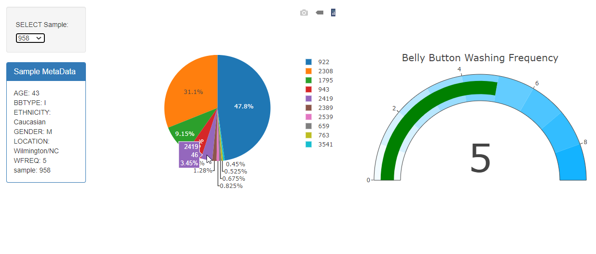

# Belly Button Biodiversity
This project is a part of the [Data Science Bootcamp](https://bootcamp.pe.gatech.edu/data/) at [Georgia Tech](https://bootcamp.pe.gatech.edu/).

#### -- Project Status: [Complete]

## Project Intro/Objective
The purpose of this project is to provide an interactive visualization for each sample in a data collection.

### Methods Used
* Flask App
* Chart Building
* Heroku Deployment

### Technologies
* Python
* Flask
* SQLAlchemy
* Pandas, jupyter
* HTML
* JavaScript
* Plotly
* Heroku

## Project Description
An exploration of data, the Belly Button Biodiversity provides the user with two interactive visualizations that dynamically update between each data sample selection.

To assist the user in sifting through the data, the page provides a dropdown with a list of each sample number. The page loads the sample's metadata in a table, filling it with various information about the sample. The data was queried from the database by the Flask app and fed to the javascript file as a JSON. A pie chart is created with each OTU from the sample and it's percentage value. A gauge displays the washing frequency of each sample to add further context to the biodiversity visuals being shown.

Following, a chart is populated with bubbles that represent each OTU. The greater the percentage, the larger the bubble. The larger the count of the OTU, the higher on the y-scale the bubble is. The x-scale represents the ID of each OTU.

The app was built using Flask in Python, and the data is kept in a sqlite database. The charts of the webpage are generated using Plotly in JavaScript. The application is hosted on Heroku ([link](https://bbd-plotly.herokuapp.com/)).

## Getting Started

1. Clone this repo (for help see this [tutorial](https://help.github.com/articles/cloning-a-repository/)).
2. Raw Data is found in the following location: 
- https://github.com/joja92/plotly-challenge/tree/master/Belly_Button_Diversity/DataSets
3. Data processing/transformation scripts are being kept [here](https://github.com/joja92/plotly-challenge/tree/master/Belly_Button_Diversity)
4. App can be found [here](https://bbd-plotly.herokuapp.com/) - or - run locally providing Python is installed with the following libraries required to run: flask, pandas, sqlalchemy, flask_sqlalchemy

## Contributing Members

**[Joseph Ayala](https://github.com/joja92)**

## Contact 
* Feel free to contact me with any questions or if you are interested in contributing!